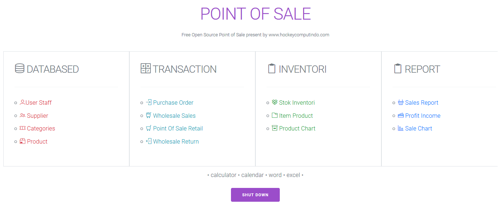
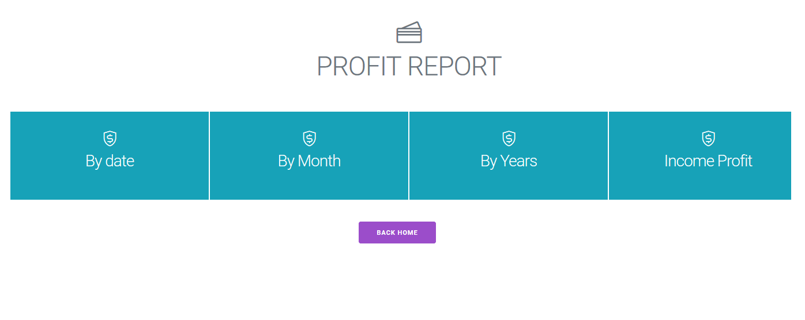
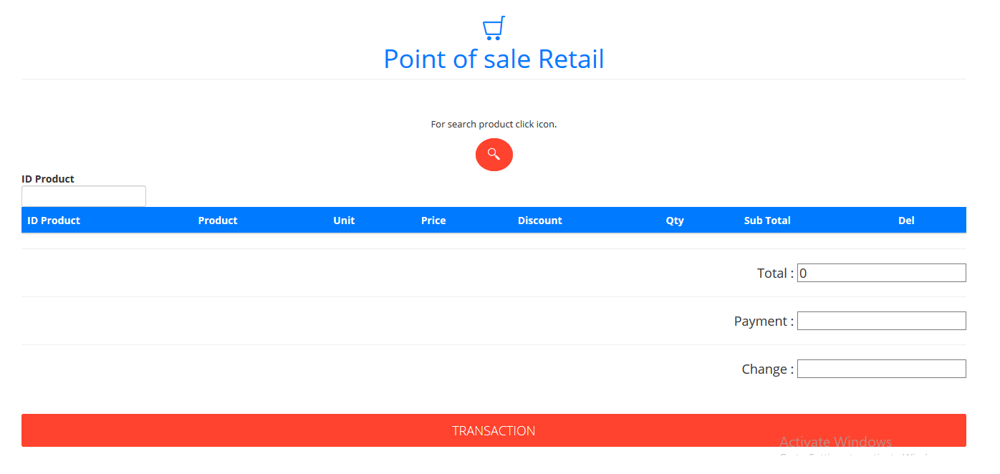
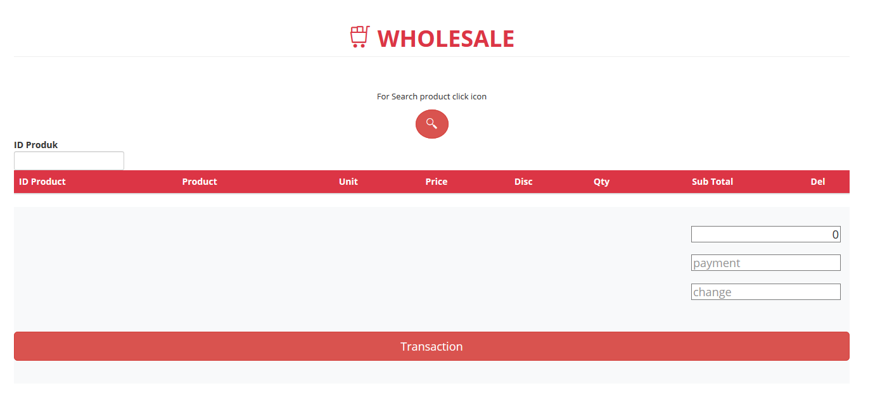

Free download with full source code point of sale POS , you can modify and customise the code fell free !!

## What is source code POS

Source code is a codding apllication to build pos system for your bussines and shop, in this free pos software you can sell to customer with wholesale dan pos retail, in case in the same produk you can make price wholesale and retail so in pos point of sale if you select a wholesale automatic wholesale product price will be generate on transaction. 

Very easy and simple to use , with compleks feature , build with [PHP](https://www.php.net/) programing language and databased used [mysql](https://www.mysql.com/) so this free source code pos can use in offline desktop terminal with local host or online clouds with online hosting. with online metode you can accsess and transaction this app from smartphone android iphone.

### Offline Installation :
+ For dekstop offline with local terminal server you pc /laptop must have [Xampp](https://www.apachefriends.org/) , Wampp , Lampp you can download it before installation this source code.
+ If you have download and install terminal server , now you must download source code pos [Donwload Here](https://sourceforge.net/projects/open-source-pos-cleanpos/files/latest/download)
+ Run Terminal server xampp , wampp , lampp
+ Open folder donwload, copy and paste in C:/xampp/htdocs folder
+ Use PHP myadmin on local host and create new databased etc:pos.sql 
+ import the databased.sql in folder installation to new databased sql - pos.sql
+ Pointing database schema in : application/config/config & database
+ open in web server : localhost/pos
+ Login with admin username and password admin

### Online Installation :
+ Login in your cpanel hosting.
+ download source code pos [Donwload Here](https://sourceforge.net/projects/open-source-pos-cleanpos/files/latest/download)
+ Open folder donwload, create new folder etc:pos copy and paste in public html folder
+ Use PHP myadmin on online host and create new databased etc:pos.sql 
+ import the databased.sql in folder installation to new databased sql - pos.sql
+ Pointing database schema in : application/config/config & database
+ open in web server : yourdomain.com/pos
+ Login with admin username and password admin

### Feature :
+ Databased to register and create new for user , supplier ,categories product , and product.
+ Transaction : Purchase order , Wholesale sale , Point of sale retail , Wholesale return .
+ Inventori management : Stok inventori , Item product , Product Chart .
+ Report : sales report, income profit report , sales chart .

### Procedure :
+ Create a new databased schema : user - supplier - categories and produk
+ After create a database you can use transaction menu: purchase order - wholesale pos - retail pos - and return wholesale pos
+ Report check in report menu 

[Play Video Teaser](https://youtu.be/cnQM86SMy3M)